# Restaurant Booking System

## Overview

The Restaurant Booking System is a full-stack web application designed for customers to book tables online and for restaurant owners to manage bookings easily. 
It features date and time-based reservations, prevents double bookings, and provides a simple menu display. 
The system aims to improve the restaurant's booking efficiency and enhance customer satisfaction.

## Features

- Date and time-based table bookings
- Prevents double bookings for the same time slot
- Booking success confirmation page
- Menu page displaying available dishes
- Admin panel for managing bookings
- Responsive design with custom CSS styling
- User-friendly navigation bar across pages
- Form validation and error handling for bookings
- **Footer**: A dynamic footer was added to all pages using JavaScript to automatically display the current year. This ensures the footer stays up-to-date without requiring manual edits each year.


## Technologies Used

- HTML5
- CSS3
- JavaScript (dynamic footer, basic form validation and dynamic interactions)
- Python 3
- Django 4
- PostgreSQL (local database)
- Gunicorn (production server)
- dj-database-url (for database connection on Heroku)
- psycopg2-binary (PostgreSQL adapter)
- Git and GitHub (version control)
- Heroku (cloud deployment)

## Installation

Follow these steps to run the project locally:

1. **Clone the repository**  
   ```bash
   git clone https://github.com/GabeColetta24/restaurant_booking.git

2. **Navigate to the project folder**:
   cd restaurant_booking

3. **Create and activate a virtual environment**:
   python3 -m venv venv
   source venv/bin/activate

4. **Install the required dependencies**:
   pip install -r requirements.txt

5. **Configure the database**:
   Ensure PostgreSQL is installed and running locally.
   Create a database named restaurant_booking_db

6. **Apply database migrations**:
   python manage.py migrate

7. **Run the development server**:
   python manage.py runserver

8. **Open the app in your browser**:
   http://127.0.0.1:8000/
   

## How to Use

1. Visit the homepage where you will see a welcome message and navigation links.
2. To make a booking:
   - Click on the **Book a Table** link in the navigation bar.
   - Fill in your details, select a date, time, and number of guests.
   - Submit the booking form.
   - If the booking is successful, you will be shown a success message.
   - If there is already a booking at the chosen time, you will be asked to pick a different time.
3. To view the restaurant menu:
   - Click on the **Menu** link in the navigation bar to see the list of dishes available.
4. Admin users can log in to the Django admin panel to manage bookings.

## Agile Planning and User Stories

This project was planned and developed following Agile principles, using an iterative and incremental approach.

### User Stories:

- **As a customer**, I want to be able to make a booking for a specific date and time so that I can reserve a table at the restaurant.
- **As a customer**, I want to be informed if a booking time is unavailable so that I can choose another time.
- **As a customer**, I want to receive confirmation that my booking was successful.
- **As a customer**, I want to view the restaurant's menu before deciding to book.
- **As a site owner**, I want to manage bookings through an admin panel so that I can efficiently oversee reservations.

### Planning Process:

The project was broken down into manageable steps:
- Set up the Django project structure and database.
- Build the booking form and model.
- Implement double booking prevention logic.
- Develop pages for booking, menu, and homepage.
- Add basic CSS styling and navigation bar.
- Prepare the project for deployment by configuring settings.
- Write thorough documentation for the project.

User Stories were addressed and implemented progressively during the development process.

### GitHub Issues

To support Agile project management, GitHub Issues were created for major tasks such as setting up the Django project, creating the booking form, preventing double bookings, adding styling, and preparing for deployment.  
Each Issue was created, worked on, and then closed once completed to demonstrate an iterative development process.

## Database Design and Models

This project uses a PostgreSQL relational database managed through Django's ORM (Object-Relational Mapping).

### Booking Model:

The `Booking` model stores information about restaurant bookings made by customers.  
It includes the following fields:

- `first_name` (CharField) — Customer's first name.
- `last_name` (CharField) — Customer's last name.
- `email` (EmailField) — Customer's email address.
- `phone` (CharField) — Customer's phone number.
- `booking_date` (DateField) — The date the customer wants to book.
- `booking_time` (TimeField) — The time the customer wants to book.
- `number_of_guests` (IntegerField) — Number of guests for the booking.
- `created_at` (DateTimeField) — Auto-generated timestamp when the booking was created.

The Booking model supports the main functionality of the project by enabling users to create, store, and manage reservations.

### Entity-Relationship Diagram (ERD):

This project has a simple data structure with one main entity:
- **Booking** (single table)

There are no complex relationships (such as foreign keys) in this project.

## Testing

Manual and functional testing was performed throughout the development process to ensure all functionality operated as expected.

---

### Manual Testing

| Feature | Action | Expected Result | Actual Result |
|--------|--------|----------------|---------------|
| Home Page | Navigate to home page | Page loads with navigation and footer | Works as expected |
| Menu Page | Open menu page | Menu items display correctly | Works as expected |
| Signup | Create new account | Account created and redirected to login | Works as expected |
| Login | Log in with valid credentials | User logged in and redirected | Works as expected |
| Logout | Click logout | User logged out successfully | Works as expected |
| Create Booking | Submit booking form | Booking saved and visible in My Bookings | Works as expected |
| View Bookings | Open My Bookings page | User sees only their bookings | Works as expected |
| Edit Booking | Update booking | Changes saved correctly | Works as expected |
| Delete Booking | Delete booking | Booking removed | Works as expected |
| Validation | Submit invalid form | Errors displayed and submission blocked | Works as expected |

---

### Feature Testing

- **Home Page**  
  - Page loads without errors  
  - Navigation bar links work correctly  
  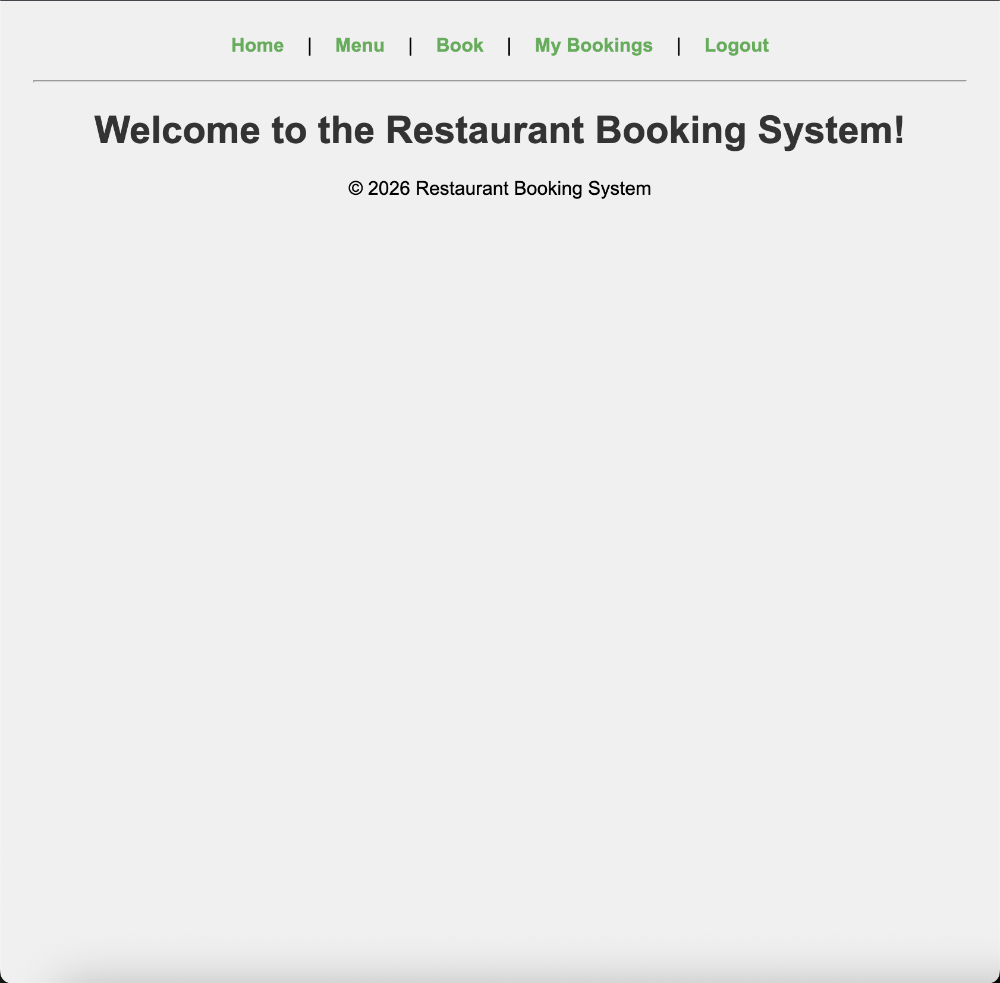

- **Booking Form**  
  - Valid bookings are successfully created  
  - Invalid submissions show appropriate errors  
  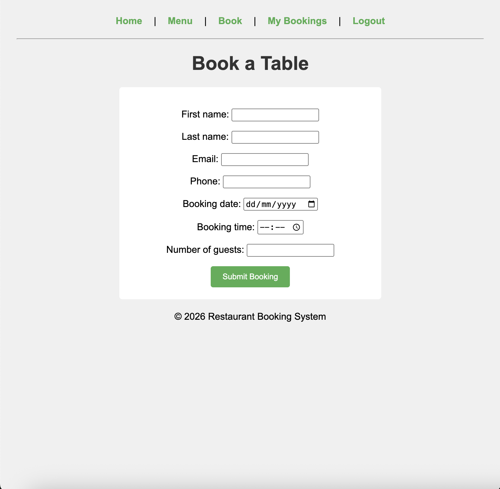

- **Double Booking Prevention**  
  - Duplicate bookings at the same date/time are prevented  
  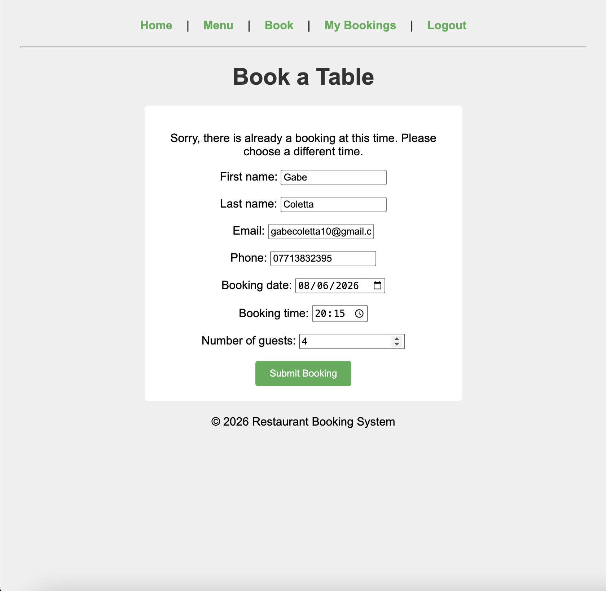

- **My Bookings Page**  
  - Displays all bookings for the logged-in user  
  - Allows users to edit or delete bookings  
  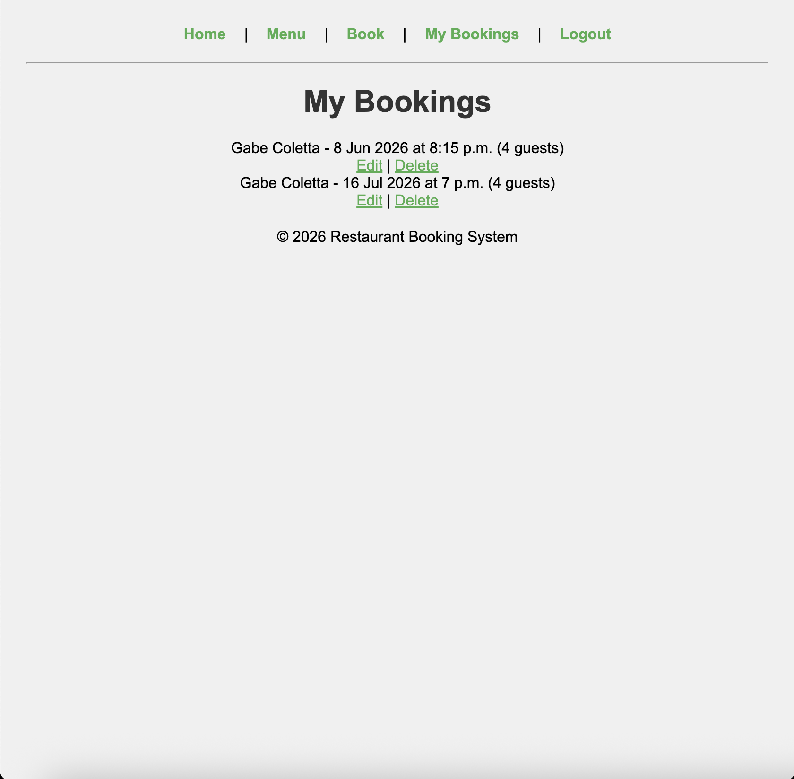

- **Booking Success Message**  
  - After a successful booking, the user is redirected to the My Bookings page  
  - A success message is displayed confirming the booking  
  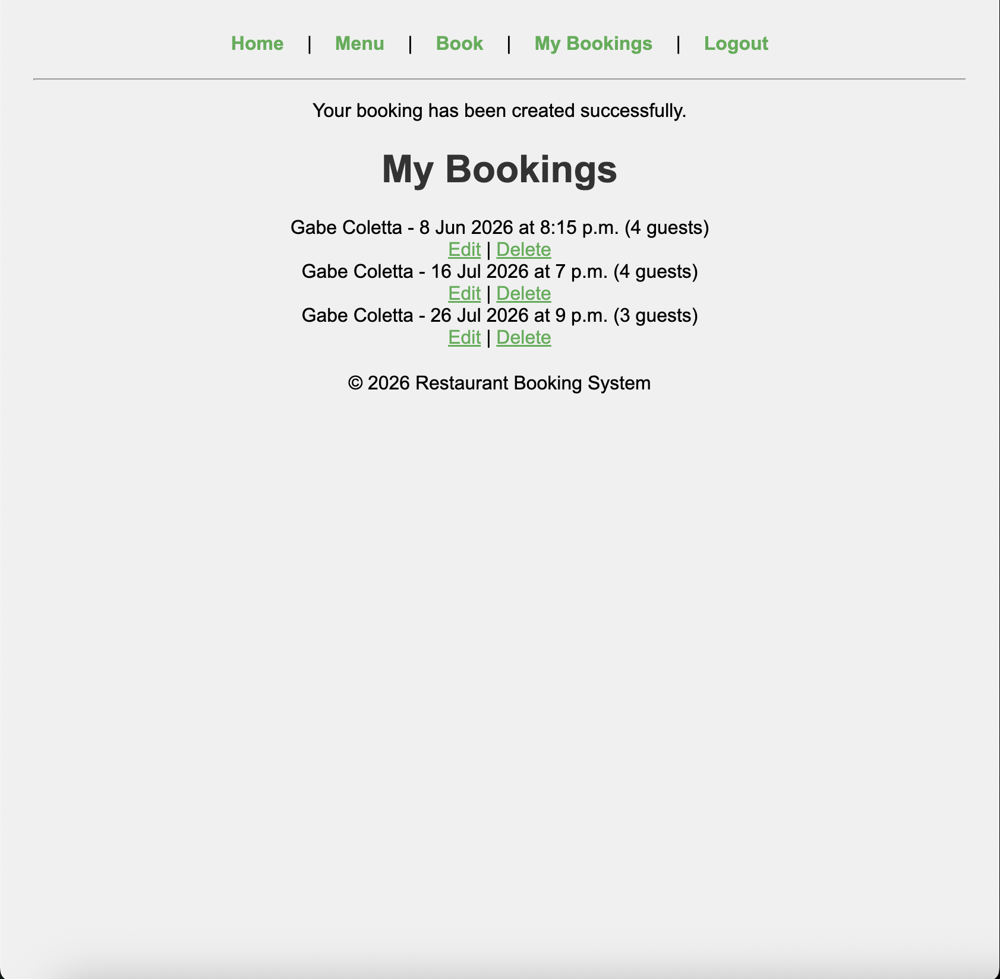

- **Edit Booking**  
  - Booking form is pre-filled and can be updated  
  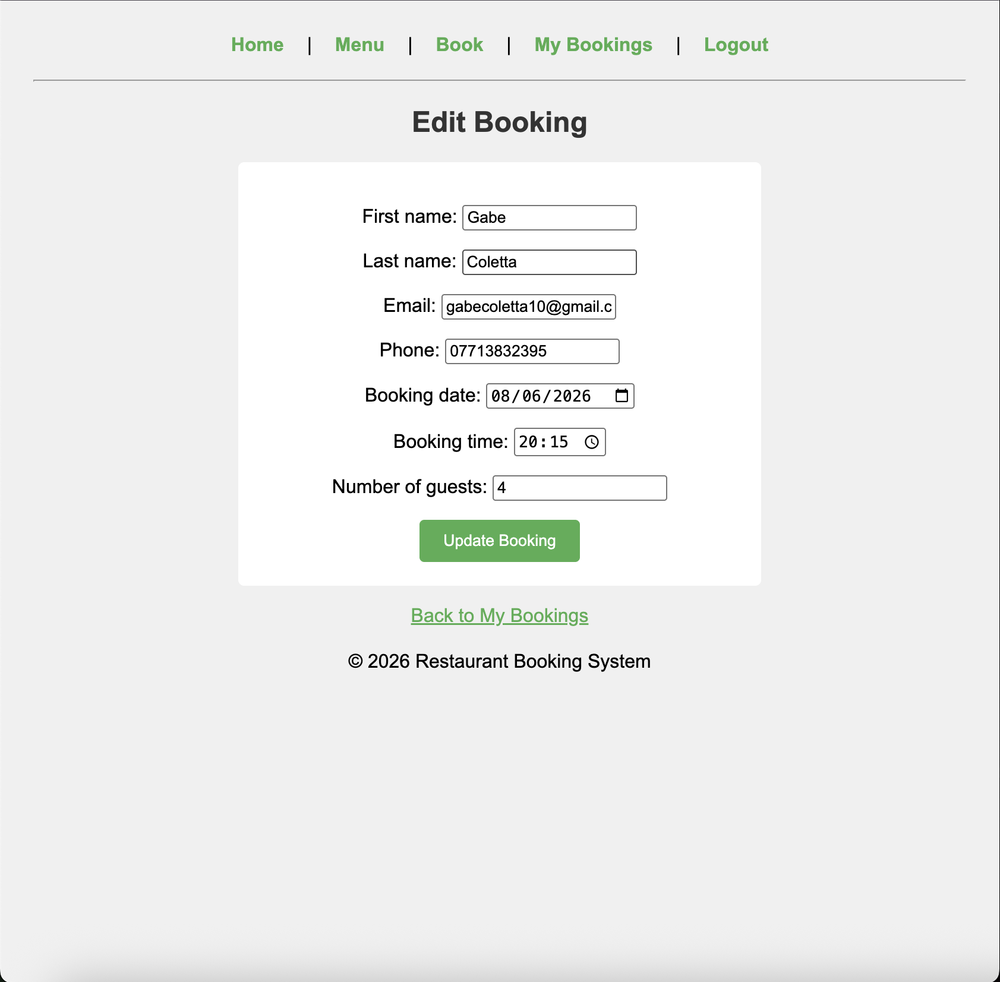

- **Delete Booking**  
  - User is asked to confirm before deleting a booking  
  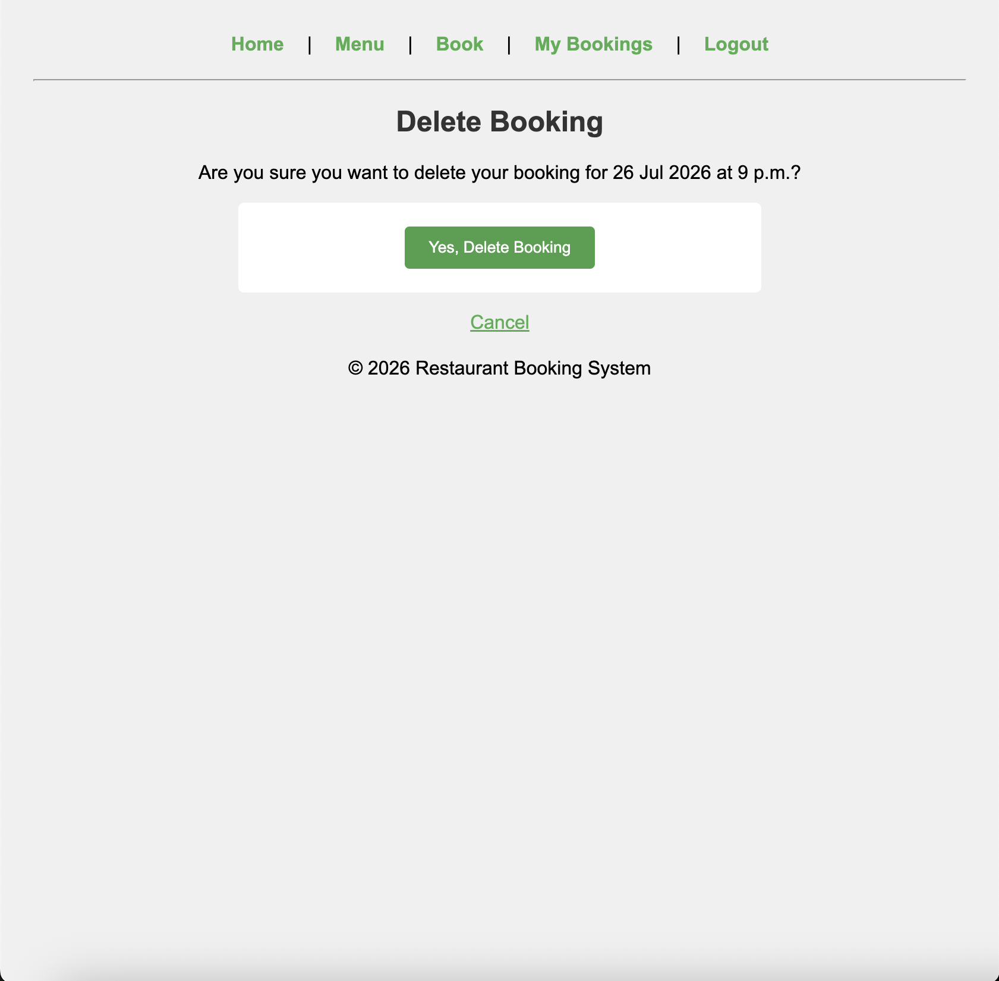

- **Navigation Bar**  
  - Navigation links are displayed correctly and update based on whether the user is logged in or not  
  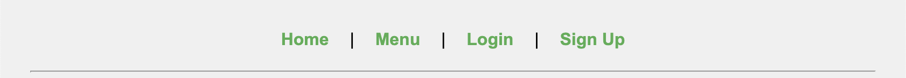
  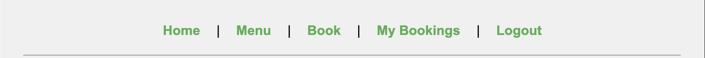

- **Menu Page**  
  - Menu items display correctly  
  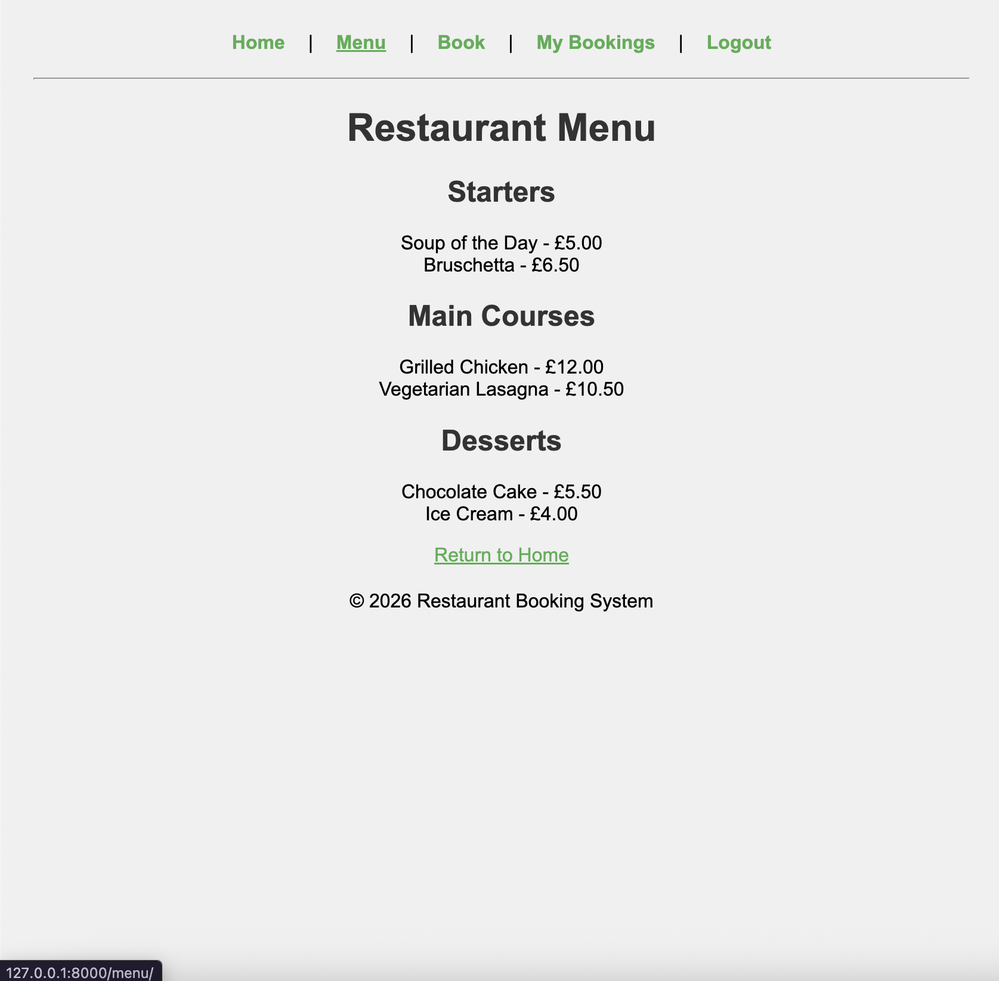

- **Admin Panel**  
  - Bookings are stored correctly and visible in admin  
  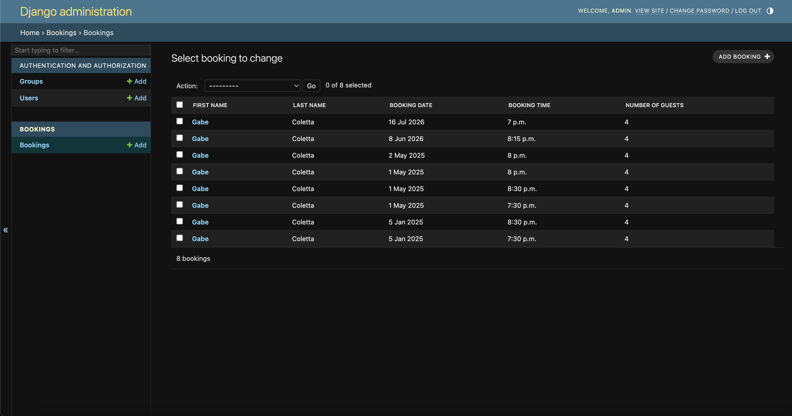

- **Footer**  
  - Dynamic year displays correctly on all pages  
  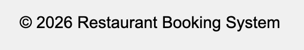

---

### Bugs Found and Fixed

- **Double Booking Issue**  
  - Users were able to create duplicate bookings for the same date/time  
  - Validation was added to prevent this  


- **Incorrect Date Format**  
  - Dates were interpreted in U.S. format  
  - Fixed by setting `LANGUAGE_CODE = 'en-gb'`  

- **Static Files Not Loading (Deployment)**  
  - Styling missing after deployment  
  - Fixed by configuring `STATIC_ROOT` and running `collectstatic`  

- **500 Error After Deployment**  
  - Database migrations were not applied  
  - Fixed by running migrations on Heroku  

---

### Validation Testing

- Forms prevent submission if required fields are left empty  
- Invalid date/time formats are rejected  
- Users cannot create bookings in the past  
- Duplicate bookings are prevented  
- Error messages are clearly displayed to the user  

---

### Browser Testing

The application was tested on:
- Google Chrome  
- Safari  

All functionality worked as expected across browsers.

---

### Deployment Testing

The application was tested on the deployed Heroku environment.

All functionality matched the local development environment, including:
- Authentication (signup/login/logout)  
- Booking creation, editing, and deletion  
- Navigation and styling  
- Form validation and error handling  

---

**All major features have been tested and confirmed to work as expected.**

---

### Automated Testing

Basic automated tests were created using Django’s built-in testing framework.

The following areas were tested:
- login is required to access protected booking pages
- logged-in users can create bookings successfully
- users cannot edit another user’s booking
- users cannot delete another user’s booking

All automated tests passed successfully.

Automated tests were run with:

```bash
python3 manage.py test
```

---

## Future Enhancements

This version of the project provides a strong foundation of core features, with opportunities for future enhancements to further refine functionality and usability:

- **User Authentication**: Implement user accounts allowing users to view, edit, or cancel their bookings.
- **Table Management**: Add functionality to assign specific tables for bookings and allow multiple tables to be booked together for larger groups.
- **Booking Cancellation**: Allow users to cancel their bookings through a dedicated page.
- **Email Confirmations**: Send an automatic email confirmation after a booking is successfully made.
- **Improved Admin Panel**: Customize the Django admin panel further to make booking management easier for administrators.
- **Mobile Responsiveness**: Further refine the responsive design for a better mobile experience.
- **Date/Time Validation**: Disable booking dates in the past from being selected on the booking form.

These enhancements would provide a richer and more robust user experience.

## Deployment

The project was deployed using [Heroku](https://www.heroku.com/) by following these steps:

1. **Set up Heroku account** and created a new application.
2. **Connected the GitHub repository** to Heroku.
3. **Configured environment variables** (`SECRET_KEY`, `DEBUG`, and `DATABASE_URL`) in Heroku's Config Vars for security and production settings.
4. **Installed Gunicorn** as the production WSGI server and added a `Procfile` to specify the web process.
5. **Installed dj-database-url** and updated the `DATABASES` configuration in `settings.py` to switch between local and Heroku databases automatically.
6. **Set up static file management** by updating `STATIC_ROOT` and running `collectstatic`.
7. **Added Heroku Postgres** as the database for storing booking information.
8. **Deployed** manually via the Heroku dashboard by clicking the **Deploy Branch** button.
9. After deployment, ran database migrations and created an admin user using the Heroku console.

The live deployed site can be accessed here:  
👉 [https://gabes-restaurant-booking-b9411bb9a465.herokuapp.com/](https://gabes-restaurant-booking-b9411bb9a465.herokuapp.com/)

## Acknowledgements

- Django documentation: [https://docs.djangoproject.com/](https://docs.djangoproject.com/)
- Heroku documentation: [https://devcenter.heroku.com/](https://devcenter.heroku.com/)
- My mentor for guidance and support throughout the project.
- Stack Overflow and online developer communities for troubleshooting assistance.
