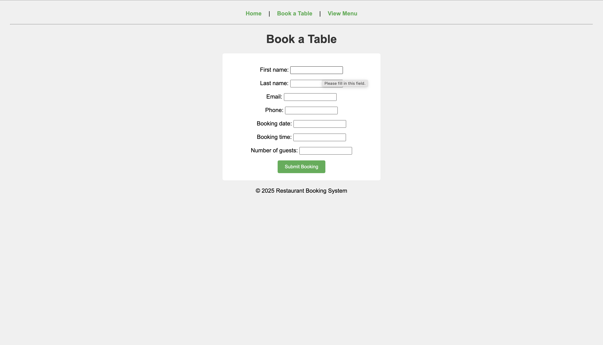
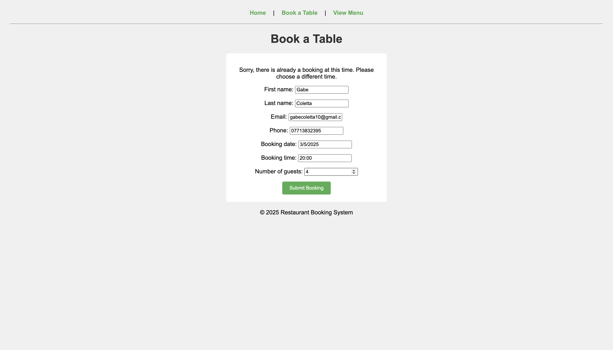
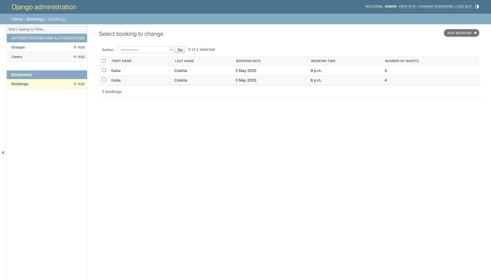

# Restaurant Booking System

## Overview

The Restaurant Booking System is a full-stack web application designed for customers to book tables online and for restaurant owners to manage bookings easily. 
It features date and time-based reservations, prevents double bookings, and provides a simple menu display. 
The system aims to improve the restaurant's booking efficiency and enhance customer satisfaction.

## Features

- Date and time-based table bookings
- Prevents double bookings for the same time slot
- Booking success confirmation page
- Menu page displaying available dishes
- Admin panel for managing bookings
- Responsive design with custom CSS styling
- User-friendly navigation bar across pages
- Form validation and error handling for bookings
- **Footer**: A dynamic footer was added to all pages using JavaScript to automatically display the current year. This ensures the footer stays up-to-date without requiring manual edits each year.


## Technologies Used

- HTML5
- CSS3
- JavaScript (dynamic footer, basic form validation and dynamic interactions)
- Python 3
- Django 4
- PostgreSQL (local database)
- Gunicorn (production server)
- dj-database-url (for database connection on Heroku)
- psycopg2-binary (PostgreSQL adapter)
- Git and GitHub (version control)
- Heroku (cloud deployment)

## Installation

Follow these steps to run the project locally:

1. **Clone the repository**  
   ```bash
   git clone https://github.com/GabeColetta24/restaurant_booking.git

2. **Navigate to the project folder**:
   cd restaurant_booking

3. **Create and activate a virtual environment**:
   python3 -m venv venv
   source venv/bin/activate

4. **Install the required dependencies**:
   pip install -r requirements.txt

5. **Configure the database**:
   Ensure PostgreSQL is installed and running locally.
   Create a database named restaurant_booking_db

6. **Apply database migrations**:
   python manage.py migrate

7. **Run the development server**:
   python manage.py runserver

8. **Open the app in your browser**:
   http://127.0.0.1:8000/
   

## How to Use

1. Visit the homepage where you will see a welcome message and navigation links.
2. To make a booking:
   - Click on the **Book a Table** link in the navigation bar.
   - Fill in your details, select a date, time, and number of guests.
   - Submit the booking form.
   - If the booking is successful, you will be shown a success message.
   - If there is already a booking at the chosen time, you will be asked to pick a different time.
3. To view the restaurant menu:
   - Click on the **Menu** link in the navigation bar to see the list of dishes available.
4. Admin users can log in to the Django admin panel to manage bookings.

## Agile Planning and User Stories

This project was planned and developed following Agile principles, using an iterative and incremental approach.

### User Stories:

- **As a customer**, I want to be able to make a booking for a specific date and time so that I can reserve a table at the restaurant.
- **As a customer**, I want to be informed if a booking time is unavailable so that I can choose another time.
- **As a customer**, I want to receive confirmation that my booking was successful.
- **As a customer**, I want to view the restaurant's menu before deciding to book.
- **As a site owner**, I want to manage bookings through an admin panel so that I can efficiently oversee reservations.

### Planning Process:

The project was broken down into manageable steps:
- Set up the Django project structure and database.
- Build the booking form and model.
- Implement double booking prevention logic.
- Develop pages for booking, menu, and homepage.
- Add basic CSS styling and navigation bar.
- Prepare the project for deployment by configuring settings.
- Write thorough documentation for the project.

User Stories were addressed and implemented progressively during the development process.

### GitHub Issues

To support Agile project management, GitHub Issues were created for major tasks such as setting up the Django project, creating the booking form, preventing double bookings, adding styling, and preparing for deployment.  
Each Issue was created, worked on, and then closed once completed to demonstrate an iterative development process.

## Database Design and Models

This project uses a PostgreSQL relational database managed through Django's ORM (Object-Relational Mapping).

### Booking Model:

The `Booking` model stores information about restaurant bookings made by customers.  
It includes the following fields:

- `first_name` (CharField) — Customer's first name.
- `last_name` (CharField) — Customer's last name.
- `email` (EmailField) — Customer's email address.
- `phone` (CharField) — Customer's phone number.
- `booking_date` (DateField) — The date the customer wants to book.
- `booking_time` (TimeField) — The time the customer wants to book.
- `number_of_guests` (IntegerField) — Number of guests for the booking.
- `created_at` (DateTimeField) — Auto-generated timestamp when the booking was created.

The Booking model supports the main functionality of the project by enabling users to create, store, and manage reservations.

### Entity-Relationship Diagram (ERD):

This project has a simple data structure with one main entity:
- **Booking** (single table)

There are no complex relationships (such as foreign keys) in this project.

# Testing

Manual and functional testing was performed throughout the development process to ensure all functionality operated as expected.

## Features Tested

- **Home Page**  
  - Confirmed the home page loads without errors.  
  - Verified that the welcome text displays correctly.  
  - Tested that the navigation bar links work and redirect to the correct pages (Menu, Book).
  

- **Booking Form**  
  - Tested form submission with valid data — booking is successfully created and a confirmation page is displayed.  
  - Tested form submission with missing or invalid fields — appropriate form errors are shown, and booking is not created.  
  

- **Double Booking Prevention**  
  - Attempted to create two bookings at the same date and time — second attempt correctly blocked with an error message.  
  - Confirmed that a new booking can be made at a different time without issues.
  


- **Booking Success Page**  
  - Confirmed that after a successful booking, the user is redirected to a 'Thank you' page displaying a success message.
  

- **Navigation Bar**  
  - Ensured that navigation links are visible on all pages.  
  - Verified that all navigation links are functional and correct.
  

- **Menu Page**  
  - Confirmed that all menu items are displayed properly.  
  - Tested page responsiveness across devices (desktop, tablet, mobile).
  

- **Styling (CSS)**  
  - Verified that CSS is properly applied on the home page, booking page, menu page, and booking success page.  
  - Confirmed that text is centered and styling remains consistent across all screen sizes.

- **Admin Panel (Django Admin Dashboard)**  
  - Verified that bookings appear correctly in the admin panel after submission.  
  - Checked that all fields (name, email, phone, date, time, number of guests) are correctly saved and visible.
  

- **Footer**: Verified that the dynamic year appears correctly across all pages.
  

## Bugs Found and Fixed

- **Double Booking Issue**  
  - **Problem**: Initially, users were able to book the same date and time multiple times.  
  - **Solution**: Validation was added in the `make_booking` view to prevent double bookings.

- **Wrong Date Format**
  - Initially, the booking form used the U.S. date format (MM/DD/YYYY) which caused confusion when booking dates. For example when a booking was made for 01/05/2025, the booking would be made for the 5th January 2025 rather than the 1st May 2025. This was corrected by updating the project settings to use British English (`en-gb`) for `LANGUAGE_CODE` in `settings.py`, ensuring dates are interpreted in the UK format (DD/MM/YYYY).
  

- **Static Files Not Loading After Deployment**  
  - **Problem**: After deployment to Heroku, the site's styling was missing because static files were not properly configured.  
  - **Solution**: Configured `STATIC_ROOT` in `settings.py`, ran `collectstatic`, and redeployed.

- **Server Error (500) on Booking Submission After Deployment**  
  - **Problem**: Migration issues prevented bookings from being saved after deployment.  
  - **Solution**: Applied migrations directly in Heroku to fix the database.

## Testing Process

- All manual testing was performed both locally (during development) and post-deployment on Heroku.
- The application was tested on different browsers (Chrome, Firefox, Safari) and different device sizes (desktop, tablet, mobile) to ensure responsiveness.
- The final version was confirmed to be working as intended without any known major issues.

 **All critical features have been manually tested and confirmed to work as expected.**

---

# Future Enhancements

This version of the project provides a strong foundation of core features, with opportunities for future enhancements to further refine functionality and usability:

- **User Authentication**: Implement user accounts allowing users to view, edit, or cancel their bookings.
- **Table Management**: Add functionality to assign specific tables for bookings and allow multiple tables to be booked together for larger groups.
- **Booking Cancellation**: Allow users to cancel their bookings through a dedicated page.
- **Email Confirmations**: Send an automatic email confirmation after a booking is successfully made.
- **Improved Admin Panel**: Customize the Django admin panel further to make booking management easier for administrators.
- **Mobile Responsiveness**: Further refine the responsive design for a better mobile experience.
- **Date/Time Validation**: Disable booking dates in the past from being selected on the booking form.

These enhancements would provide a richer and more robust user experience.

## Deployment

The project was deployed using [Heroku](https://www.heroku.com/) by following these steps:

1. **Set up Heroku account** and created a new application.
2. **Connected the GitHub repository** to Heroku.
3. **Configured environment variables** (`SECRET_KEY`, `DEBUG`, and `DATABASE_URL`) in Heroku's Config Vars for security and production settings.
4. **Installed Gunicorn** as the production WSGI server and added a `Procfile` to specify the web process.
5. **Installed dj-database-url** and updated the `DATABASES` configuration in `settings.py` to switch between local and Heroku databases automatically.
6. **Set up static file management** by updating `STATIC_ROOT` and running `collectstatic`.
7. **Added Heroku Postgres** as the database for storing booking information.
8. **Deployed** manually via the Heroku dashboard by clicking the **Deploy Branch** button.
9. After deployment, ran database migrations and created an admin user using the Heroku console.

The live deployed site can be accessed here:  
👉 [https://gabes-restaurant-booking-b9411bb9a465.herokuapp.com/](https://gabes-restaurant-booking-b9411bb9a465.herokuapp.com/)

